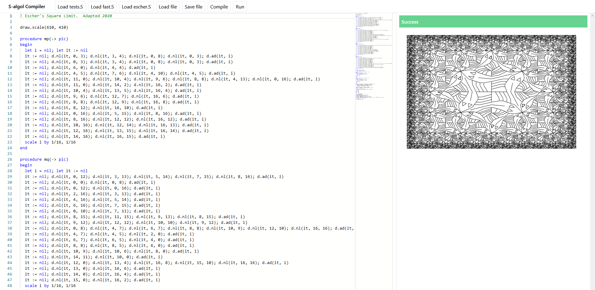

<h1 align="center"><a href="https://cmcarey.github.io/S-algol/">S-algol Compiler</a></h1>

A compiler for the S-algol programming language.

Built for my [BSc thesis](./report.pdf).

- Grammar was converted to LL-1 context free form, and a parser generator was built to take this form and create a fully typed Typescript parser
- Analysis is performed according to S-algol type rules
- Code generation targets Javascript
- A web IDE is provided replete with syntax highlighting editor and REPL environment for running S-algol programs and viewing text and vector output

